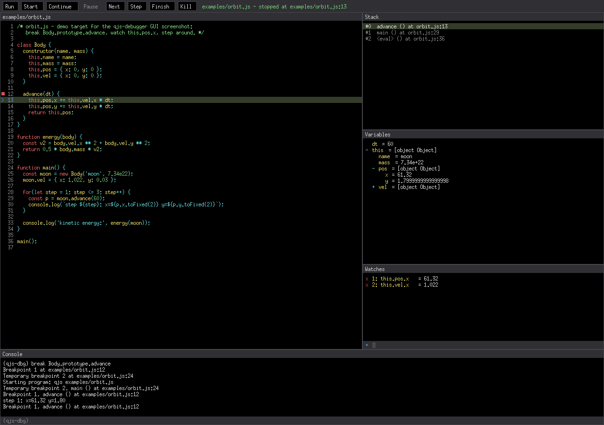

# qjs-debugger

A gdb-style source-level debugger for [QuickJS](https://github.com/rsenn/quickjs)
(rsenn fork), written in JavaScript and running on QuickJS itself. Two
frontends — an interactive terminal REPL and a native GUI (nanovg/glfw) —
drive the engine's built-in debugger protocol over a pluggable transport.

## Features

- **gdb-compatible command set** — `run`, `start` (temporary breakpoint on
  `main()`, falls back to the first top-level statement), `starti`,
  `continue`, `next`, `step`, `finish`, `backtrace`/`frame`/`up`/`down`,
  `print`, `display`/`undisplay` (watches), `info
  breakpoints|locals|stack|frame|display`, `list`, `catch`, `kill`,
  `set args`, `file`, `--args` on the command line, empty line repeats the
  last stepping command, unique-prefix command matching and the usual
  single-letter aliases (`b`, `r`, `c`, `n`, `s`, `p`, `bt`, …).
- **Breakpoints by location or name** — `file.js:12`, plain line numbers,
  function names and `Class.prototype.methodName`, resolved by a simple
  RegExp scan over the primary source and everything it reaches through
  relative imports (no parser needed).
- **Tab completion** — debuggee identifiers (locals, closure, globals of
  the selected frame) for `print`/`display`, source files and scanned
  function names for `break`.
- **GUI mode** (`-m gui`) — source pane with the REPL's syntax-highlight
  colors and a click-to-toggle breakpoint gutter, stack pane with frame
  selection, lazily expanded (and cycle-safe) variables tree, a watches
  pane sharing the `display` model, a console with a full gdb command
  line (completion + history), hover value tooltips, a source file
  picker, clickable scrollbars, and F5/F10/F11/Shift-F11/Ctrl-R keys.
- **Transport-agnostic** — `AsyncSocket` from qjs-modules' `sockets`
  (default) or lws raw TCP streams from qjs-lws (`-t lws`); in both
  directions: the debugger listens and the engine connects out
  (default), or the engine listens and the debugger connects (`-c`).
- **Two install names** — `qjs-debugger` spawns `qjs` as the debuggee,
  `qjsm-debugger` (a symlink) spawns `qjsm`.

*The GUI mode stopped inside `Body.prototype.advance` of
[examples/orbit.js](examples/orbit.js): breakpoint set by method name
from the console's gdb prompt, the stop line highlighted in the
syntax-colored source, the call stack with the selected frame, `this`
expanded two levels deep in the variables tree, two watch expressions
tracking `this.pos.x` and `this.vel.x` across stops, and the program's
own stdout interleaved with the session log in the console.*

Because the engine-side protocol (`CONFIG_DEBUGGER`, on by default in the
fork) is compiled into libquickjs, any script or module that runs under
`qjs`/`qjsm` can be debugged — making this the missing piece for everyday
QuickJS development: set a breakpoint by function name, step through
module code, inspect locals and closures, watch expressions across stops.

## Usage

    qjs-debugger script.js                  # debug script.js under qjs
    qjs-debugger --args script.js a b c     # pass arguments to the program
    qjsm-debugger script.js                 # same, debuggee runs under qjsm
    qjsm-debugger -m gui script.js          # native GUI instead of the REPL

    -m, --mode MODE       repl | server | gui   (default: repl)
    -a, --address ADDR    debug address          (default: 127.0.0.1:9901)
    -l, --listen          listen on ADDR, engine connects out (default)
    -c, --connect         engine listens on ADDR, debugger connects
    -t, --transport NAME  socket (AsyncSocket) | lws (TCPSocketStream)

A typical REPL session:

    (qjs-dbg) break Counter.prototype.increment
    Breakpoint 1 at test.js:11
    (qjs-dbg) start
    Temporary breakpoint 2 at test.js:17
    Temporary breakpoint 2, main () at test.js:17
    (qjs-dbg) next
    (qjs-dbg) print c.n + 1
    $1 = 1
    (qjs-dbg) display this.n
    (qjs-dbg) continue
    Breakpoint 1, increment () at test.js:11

In the GUI the same engine/session is driven by clicks: the gutter
toggles breakpoints, the source pane title opens a file picker for
setting breakpoints in other sources, stack rows select frames, `+`
rows expand objects, the watches pane adds/removes expressions, and the
console's `(qjs-dbg)` prompt accepts every REPL command with completion.

To attach to an engine you started yourself, arm it with the
environment variable and let the debugger connect:

    QUICKJS_DEBUG_LISTEN_ADDRESS=127.0.0.1:9901 qjsm myscript.js &
    qjsm-debugger -c -a 127.0.0.1:9901 myscript.js

(the reverse direction uses `QUICKJS_DEBUG_ADDRESS` with the debugger
in its default listening mode).

## Dependencies

| What | Needed for | Notes |
| --- | --- | --- |
| [rsenn/quickjs](https://github.com/rsenn/quickjs) | everything | engine with the debugger protocol (`CONFIG_DEBUGGER`, default ON) |
| qjs-modules (submodule) | everything | `qjsm`, `repl`, `sockets`, `child_process`, `fs`, `path`, … |
| qjs-glfw + qjs-nanovg (submodules) | `-m gui` | need GLFW 3 and OpenGL development packages |
| qjs-lws (submodule) | `-t lws` only | vendored libwebsockets |
| `~/.fonts/MiscFixedSC613.ttf` | `-m gui` | falls back to DejaVu Sans Mono |
| cmake ≥ 3.9, C compiler | building | |

## Building

Everything lives in the quickjs fork; the subprojects are git
submodules and build through the top-level CMakeLists:

    git clone --recurse-submodules https://github.com/rsenn/quickjs.git
    cd quickjs

    cmake -B build/native \
      -DCMAKE_BUILD_TYPE=RelWithDebInfo \
      -DBUILD_SHARED_LIBS=ON \
      -DMODULE_MODULES=ON \
      -DMODULE_DEBUGGER=ON \
      -DMODULE_GLFW=ON -DMODULE_NANOVG=ON     # only needed for -m gui
      # -DMODULE_LWS=ON                       # only needed for -t lws

    cmake --build build/native -j$(nproc)
    cmake --install build/native

What the pieces produce:

- **quickjs** — `libquickjs` and `qjs`, with the debugger protocol
  compiled in (`CONFIG_DEBUGGER` defaults to ON on native builds; the
  engine reads `QUICKJS_DEBUG_ADDRESS` / `QUICKJS_DEBUG_LISTEN_ADDRESS`).
- **qjs-modules** (`MODULE_MODULES`, default ON) — the `qjsm`
  interpreter, the native modules (`sockets`, `child_process`, …) and
  the JS library incl. `repl.js`, installed into the module directory.
- **qjs-debugger** (`MODULE_DEBUGGER`, default ON) — `bin/qjs-debugger`,
  the `bin/qjsm-debugger` symlink, the support modules
  (`codec.js`, `session.js`, `transport.js`, `engine-connection.js`)
  and `bin/gui/` for the GUI mode.
- **qjs-glfw / qjs-nanovg** (`MODULE_GLFW` / `MODULE_NANOVG`, default
  OFF) — the `glfw` and `nanovg` modules the GUI imports.
- **qjs-lws** (`MODULE_LWS`, default OFF) — the `lws.so` stack behind
  the optional `tcpsocketstream` transport.

Each subproject also has its own CMakeLists and can be configured
standalone against an installed quickjs, but the all-in-one build above
is the supported path.

## Architecture

Small modules with strict layering; every class talks to its neighbors
through a minimal duck-typed contract:

    codec.js              framing only: %08x\n + JSON + \n, incremental decoder
    session.js            protocol state machine: seqs, pending requests, events (zero imports)
    transport.js          byte transports: SocketTransport ('sockets') and
                          StreamTransport (qjs-lws), each with connect() and accept()
    engine-connection.js  framed messages over an injected transport; StartEngine()
                          spawns the debuggee with the debugger armed
    qjs-debugger.js       the Debugger model + gdb command interpreter + REPL mode
    gui/                  immediate-mode MVC panes on nanovg/glfw (see gui/PLAN.md)
    server-adapter.js,    N clients <-> 1 engine fan-out and WebSocket connectors
    connector-*.js,       for the (stub) server mode and browser clients
    client.js

The three load-bearing contracts: a **transport** is
`{ [Symbol.asyncIterator](), send(data), close() }` with static
`connect(address, options)` / `accept(address, options)` (accept fires
`options.listening()` once bound — the engine's outgoing connect does
not retry); a **DebugSession** is constructed with a `send(obj)`
function and fed via `dispatch(obj)`; the **Debugger** model is
headless — output goes through injected `print`/`printRaw` sinks and an
`onEvent('running'|'stopped'|'exited')` hook, which is how the same
class backs both the REPL and the GUI.
